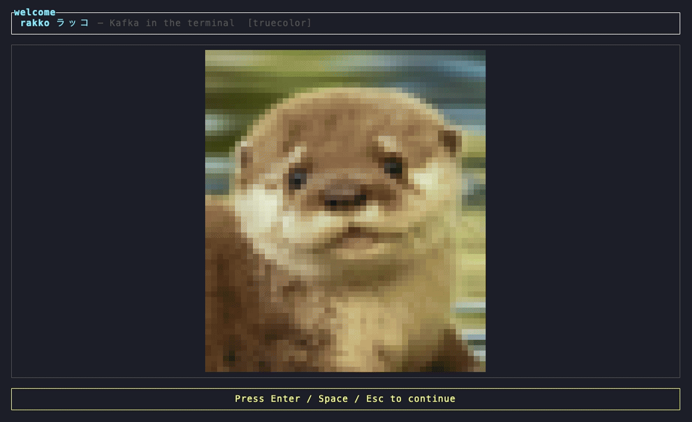
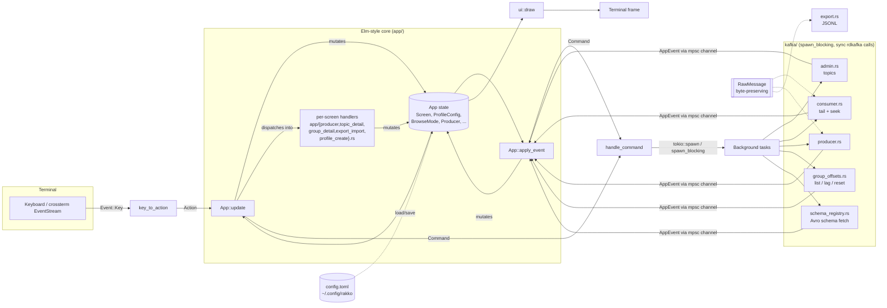

# rakko

<p align="center">
  
</p>

**rakko** (ラッコ, Japanese for "sea otter" — as opposed to カワウソ, "river otter," which would arguably fit the streaming metaphor better) is a fast, keyboard-driven terminal UI for Kafka — everything you need for day-to-day cluster work without waiting on a browser tab or a bloated desktop client. Built with [ratatui](https://ratatui.rs/) and [rdkafka](https://github.com/fede1024/rust-rdkafka).

Browse topics and messages (live tail + seek), inspect consumer groups and lag, reset offsets, produce/replay messages, and export/import JSONL — all from the terminal, all scriptable, all fast.

**Why rakko over the usual Kafka GUI:**

- **No message-size ceiling on replay.** Replay and export operate on raw wire bytes, never a decode-then-re-encode round trip — resend a message byte-identical, Avro schema ID and all, no matter how large. Most GUI tools quietly cap this around 1MB; rakko doesn't.
- **Avro just works.** Auto-detects Confluent-wire-format Avro, fetches and caches the schema from your registry, and decodes it inline for browsing and filtering — without ever mutating the bytes you'd actually resend.
- **JSONL export/import is a real backup format**, not a debugging dump — base64 raw bytes are the source of truth, so reimporting is byte-identical too.
- **Kubernetes-friendly by staying out of the way** — no baked-in `kubectl`/port-forward magic to trust or debug. Point it at your tunnel like any other TLS/mTLS client.
- **No runtime dependencies.** Prebuilt macOS and RHEL 9 binaries have librdkafka and OpenSSL statically linked in — nothing else to install.
- **It's a TUI.** No Electron, no browser tab, no waiting for a page to load — `j`/`k` and it's already there.

## Demo



## Features

- **Connect to any cluster** — save named profiles (plaintext, TLS, or mutual TLS)
  and switch between clusters without leaving the TUI
- **See what's going on** — topic list with partition/replication/compression info,
  and a brokers view with per-broker load and overall cluster health
- **Browse messages your way** — watch a topic live as messages arrive, or page back
  through history; filter by plain text, or write a structured query against JSON/Avro
  fields (e.g. "only messages where `value.status = "failed"`")
- **Avro decoded automatically** — point rakko at your Schema Registry and Avro
  messages show up as readable JSON, no manual schema handling
- **Keep an eye on consumer groups** — see members and per-partition lag, and reset
  offsets if a group gets stuck
- **Send and resend messages** — write a new message from the terminal, or replay an
  existing one byte-for-byte back to its topic
- **Back up and restore topics** — export messages to a file and import them again
  later, byte-identical to the originals
- **Use a mouse or just the keyboard** — click and scroll, or stay entirely on the
  keyboard — both are fully supported

## Quick start

Prebuilt binary (macOS or RHEL 9 — no Rust/CMake toolchain needed): grab
`rakko-macos-<arch>.tar.gz` or `rakko-linux-amd64.tar.gz` from the
[Releases](https://github.com/ultish/rakko/releases) page, or build one yourself —
see [Release builds](#release-builds).

Otherwise, build from source (`cargo run` for a debug build, or `cargo build --release`
+ `./target/release/rakko` for release — needs Rust + CMake, see
[Development](#development)):

```bash
cargo build --release
./target/release/rakko
```

No config yet, so rakko opens a **create-profile form** — enter your cluster's
bootstrap servers (and auth, if needed), press Enter to save and connect. See
[Configuration](#configuration) below for TLS/mTLS examples and the on-disk format.

Once you have a saved profile, pass `--profile <name>` to skip the picker
(`cargo run -- --profile local`, or `./target/release/rakko --profile local`).

Don't have a cluster handy? [Development](#development) has a local Docker Compose
stack (Kafka + Schema Registry) to try rakko against.

## Configuration

Config lives at **`~/.config/rakko/config.toml`** on both macOS and Linux (not `~/Library/Application Support`).

Logs are written to **`~/.config/rakko/rakko.log`** (never to the TTY while the UI is running). Control verbosity with `RUST_LOG` (e.g. `RUST_LOG=info`).

### First run / in-app profile creation

If the config file is missing or has **no profiles**, rakko opens a **create-profile form** on startup:

- **Name**, **bootstrap servers** (default `localhost:9092`), **Auth**, optional **Schema Registry URL**
- **Tab** / **Shift-Tab** move fields · **←**/**→**/**Home**/**End** edit within a field · **Delete** forward-delete · **Space**/**t** cycles **Auth** (plaintext → TLS, system trust store → TLS, private CA → mTLS) while it's focused · **Enter** saves · **Esc** quits (when no profiles exist yet)
- Picking **TLS, private CA** or **mTLS** reveals **CA path** (and, for mTLS, **client cert path** / **client key path**) fields
- Saves to `~/.config/rakko/config.toml` (creates the directory if needed)
- Editing an existing profile (**e**) prefills its current auth mode and cert/key/CA paths, and saving changes them

On the **profile picker** (after you have at least one profile): **n** opens the same form to add another. **Esc** from the topic list returns to the picker.

You can still hand-edit the TOML anytime and restart (or re-select the profile).

Override the directory:

```bash
cargo run -- --config-dir /path/to/dir
# reads /path/to/dir/config.toml
```

### Example profile (PLAINTEXT)

```toml
[[profiles]]
name = "local"
bootstrap_servers = "localhost:19092"
tls_enabled = false
schema_registry_url = "http://localhost:18081"

[profiles.auth]
type = "none"
```

### TLS with a private CA (no client cert)

```toml
[[profiles]]
name = "internal"
bootstrap_servers = "kafka.internal:9093"
tls_enabled = true

[profiles.auth]
type = "tls"
ca_path = "/path/to/private-ca.pem"
```

### mTLS profile

```toml
[[profiles]]
name = "prod"
bootstrap_servers = "kafka.example.com:9093"
tls_enabled = true
# optional: pin client message.max.bytes (skip broker auto-detect on connect).
# If omitted, rakko reads the broker's message.max.bytes and writes it here.
# message_max_bytes = 20000000

[profiles.auth]
type = "mtls"
cert_path = "/path/to/client.pem"
key_path = "/path/to/client.key"
ca_path = "/path/to/ca.pem"
```

Optional per-profile producer knobs:

```toml
[profiles.extra_producer_config]
"compression.type" = "zstd"
```

## Message browsing

### Schema Registry (Avro)

Set `schema_registry_url` on the profile (see example above). When browsing messages:

1. Values with the Confluent wire format (`0x00` + 4-byte schema id) are tagged `avro:<id>` (or `avro:<id>?` until the schema is cached).
2. rakko fetches `GET {url}/schemas/ids/{id}` in the background and caches the Avro schema.
3. After the cache hit, the **Value** column shows decoded JSON; filter (`/`) also searches the decoded text.
4. Failed fetches are not retried until you reconnect the profile; status line shows the error.
5. **Replay / export always use raw bytes** — lookup is display/filter only.

No `schema_registry_url` → Avro is still detected, but not decoded (hex/raw fallback).

### Advanced query filter

The plain `/` filter is a substring search. **`?`** opens a second, independent filter
— as a dialog, with room for a longer chained query and a built-in help panel — that
queries structured fields inside JSON/Avro keys and values:

```
key.person.name = jxhui AND key.person.age = 20 AND value.house.owner = jxhui
```

- Paths start with `key.` or `value.`, then dot-separated field names — any depth.
- `=` / `!=` / `>` / `<` / `>=` / `<=`. String/number/`true`/`false` literals (quote
  strings with spaces: `value.title = "hello world"`; string comparison is
  case-insensitive). `>`/`<`/`>=`/`<=` need a numeric value on both sides, e.g.
  `value.timestamp > 23434`.
- Chain conditions with `AND` (only `AND` — no `OR`/parens yet).
- **Arrays**: a path through an array matches if *any* element satisfies the rest of
  the path — same implicit behavior as MongoDB's dot-notation array queries, e.g.
  `value.items.sku = "ABC123"` matches if any element of `items` has that sku, no
  index needed, at any depth (arrays of arrays included). Same any-element rule for
  `>`/`<`/etc: `value.scores > 90` matches if any element of `scores` exceeds 90.
- Needs the same Avro schema-cache as the substring filter — a message whose schema
  hasn't loaded yet won't match a `key.`/`value.` condition until it does.
- Independent from `/`: apply both and a message must satisfy each. **c** clears
  whichever filter(s) are applied.
- A parse error is shown in the status line and keeps the query editor open so you
  can fix it. **Ctrl-h** inside the dialog toggles a syntax/examples help panel.
- **Tab** completes `key`/`value`, then cycles through field names actually present
  on the current page (`value.` → every top-level field; keep tabbing to go deeper,
  e.g. `value.house.` → `owner`/`price`/`rooms`) — the candidate list is shown with
  the current pick highlighted. Only completes at the end of the input.

## Keybinds

Global: **`q`** quit (confirms) · **Ctrl-c** force quit · **Esc** back · **j/k** or arrows move · **Enter** confirm · **`A`** toggle banner braille-stream animation.

On any of the list-level screens (Topics, Messages, Groups, Group detail, Brokers,
Broker detail) a **switcher bar** sits under the banner: `1 Topics   2 Groups   3
Brokers`, with the active view highlighted. **1**/**2**/**3** jump straight there —
the only way to move between top-level views (no per-screen `g`/`b` shortcuts, so it
means the same thing everywhere it appears). Producer/Export-import/Create-profile
don't show it — a stray digit there would clobber an in-progress draft.

Shortcuts are kept consistent app-wide: **e** always means *edit* (profile picker,
replay's "edit in producer"), never anything else. Export uses **x**/**X** instead.

| Screen | Keys |
|--------|------|
| **Profile picker** | **Enter** connect · **n** new profile · **e** edit profile · **q** quit |
| **Create profile** | **Tab** / **Shift-Tab** fields · **←**/**→**/**Home**/**End** cursor · **Delete** · **Space**/**t** cycle Auth · **Enter** save · **Esc** cancel/quit |
| **Topics** | **Enter** open topic · **r** refresh list · **/** filter by name · **c** clear filter · **1**/**2**/**3** switch view |
| **Messages** | **Enter** view full message · **Tab**/**s** tail ↔ seek · **o** sort newest/oldest · **n**/**p** or PgDn/PgUp page · **r** refresh page (seek) · **/** filter · **?** query filter · **c** clear filter(s) · **w** produce · **y** replay · **x** export selected · **X** export all visible · **i** import · **1**/**2**/**3** switch view |
| **Message view** | 2×2 grid: **Attrs** (topic/partition/offset/timestamp/formats) + **Headers** on top, **Key**/**Value** below · **j**/**k** or **↑**/**↓** scroll the focused panel · **PgUp**/**PgDn** page · **Tab**/click switch focus between **Headers**/**Key**/**Value** (Attrs has no scrollback, so isn't focusable) · **←**/**→** resize the focused panel against its row-mate (Attrs↔Headers or Key↔Value) · **Enter**/**Esc** close · **y** replay · **x** export this message |
| **Groups** | **Enter** detail · **r** refresh list · **/** filter by name · **c** clear filter · **1**/**2**/**3** switch view |
| **Group detail** | **z** reset offsets · **r** refresh lag (also auto every ~3s while open) · **1**/**2**/**3** switch view |
| **Brokers** | **Enter** view broker config · **r** refresh list · **1**/**2**/**3** switch view |
| **Broker detail** | **r** refresh config · **Esc** back · **1**/**2**/**3** switch view |
| **Producer** | **Tab** focus · **F3**/Ctrl-m mode (inline / file / `$EDITOR`) · **F2**/Ctrl-p send · **Esc** back |
| **Replay** | **y**/**Enter** raw replay (byte-identical) · **e** edit in producer · **n**/**Esc** cancel |
| **Export/import** | type path · **←**/**→**/**Home**/**End** cursor · **Delete** · **Tab** (import: path ↔ topic) · **Enter** run · **Esc** back |

Offset reset only works reliably when the group has **no active members** — the UI warns if members are present.

### Mouse

- **Scroll wheel** navigates whichever list is on screen (or scrolls the message
  inspector, when it's open).
- **Click** a list row to select it; **double-click** opens it (same as **Enter**).
  Hovering a row highlights it.
- **Click** a producer or export/import field box to focus it directly, instead of
  Tab-cycling to it.
- **Click** `1 Topics` / `2 Groups` / `3 Brokers` in the switcher bar to jump there.

### What updates live

| Data | Live? |
|------|--------|
| Messages in **tail** mode | Yes — continuous consumer poll |
| Messages in **seek** mode | No — load pages with **n**/**p** |
| Topic list / group list / broker list / broker config | On open, or **r** refresh |
| Group lag / members | On open, **r**, or auto ~every 3s while detail is open |

## Release builds

Prebuilt, statically-linked binaries — no separately-installed librdkafka/OpenSSL
required. Both scripts write into `dist/` (a shared `SHA256SUMS` is merged, not
clobbered, so you can run either or both).

### RHEL 9 binary (Linux/amd64)

Cross-builds a glibc-compatible **linux/amd64** binary via a Rocky 9 container, with statically vendored librdkafka + OpenSSL:

```bash
./scripts/build-tui-rhel9.sh
# optional: DOCKER=container|docker|podman
# optional: --no-cache
```

Artifacts land in `dist/`:

- `rakko-linux-amd64` / `rakko`
- `rakko-linux-amd64.tar.gz`
- `SHA256SUMS`
- `ldd.txt` — dynamic-link audit (should be glibc/libgcc_s only)

Requires a working container runtime with **linux/amd64** support (on Apple Silicon: Rosetta or Apple Container). First build is slow (compiles librdkafka + OpenSSL).

### macOS binary

Native build (no container) — runs on whatever Mac you're on, producing that Mac's
architecture (`arm64` or `x86_64`). The same vendored librdkafka/OpenSSL Cargo
features apply on any platform, so this is just `cargo build --release` plus
packaging to match the RHEL 9 script's `dist/` conventions:

```bash
./scripts/build-macos.sh
```

Artifacts land in `dist/`:

- `rakko-macos-<arch>`
- `rakko-macos-<arch>.tar.gz`
- `SHA256SUMS` (merged with any RHEL 9 entries)
- `otool-macos-<arch>.txt` — dynamic-link audit (should be system frameworks + libSystem/libiconv only)

## Development

Building from source (including any of the `cargo` commands below) needs:

- **Rust** (stable) — [rustup](https://rustup.rs/)
- **CMake** + a C/C++ toolchain — required to build `rdkafka` (`cmake-build`, vendored OpenSSL)
  - macOS: `xcode-select --install` and `brew install cmake`
  - Linux: `gcc`, `g++`, `make`, `cmake`, `perl`

A local Docker Compose stack (Kafka + Schema Registry) covers manual testing and the
`--ignored` integration tier — nothing else in the repo depends on it.

```bash
docker compose up -d
```

| Service          | Host address        |
|------------------|---------------------|
| Kafka            | `localhost:19092`   |
| Schema Registry  | `http://localhost:18081` |

Non-default host ports (19092/18081, not 9092/8081), deliberately chosen so this
stack doesn't collide with an unrelated Kafka deployment that may already be running
on your machine. Stop it with `docker compose down`.

```bash
cargo test                     # pure-logic tests (no broker)
cargo test -- --ignored        # integration tests against the compose stack above

# Try the UI against the compose stack:
mkdir -p ~/.config/rakko
cp config.example.toml ~/.config/rakko/config.toml
cargo run -- --profile local
```

### Architecture

Elm-style: input and background I/O both flow into a single `App::update` reducer;
rendering is a pure function of `App` state. Background Kafka/HTTP calls never run on
the render loop — see [PLAN.md](./.agents/PLAN.md) for the full design rationale.



Everything that talks to Kafka or the network runs inside `kafka/` on a
`tokio::task::spawn_blocking` (rdkafka's client is sync), reporting results back as an
`AppEvent` over an `mpsc` channel; the render loop's `tokio::select!` merges that
channel with terminal input and a couple of timer ticks (group-lag auto-refresh,
banner animation). `RawMessage` (`src/raw_message.rs`) is the one byte-preserving type
threaded through browsing, replay, and export/import, so replayed/exported messages
are never a decode-then-re-encode round trip.

Design notes and milestone plan: [PLAN.md](./.agents/PLAN.md).

## License

See repository owners for licensing.
